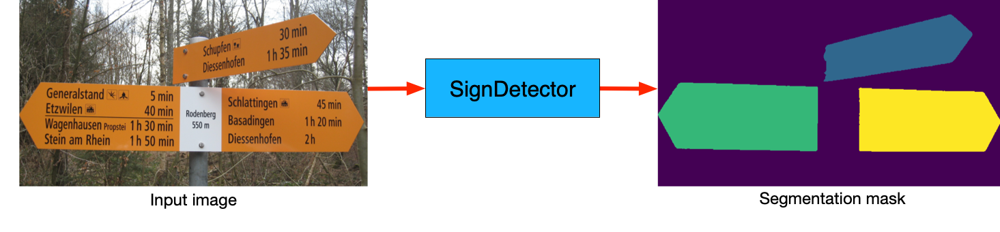
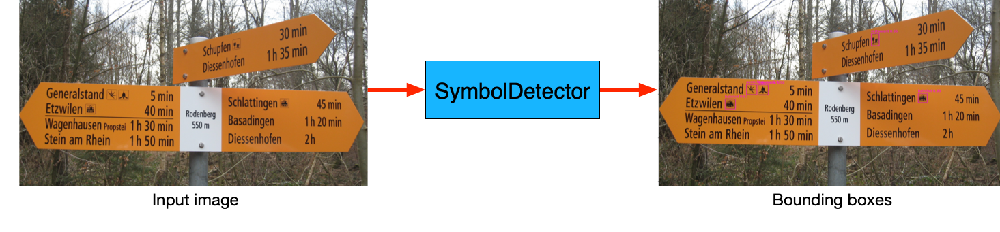
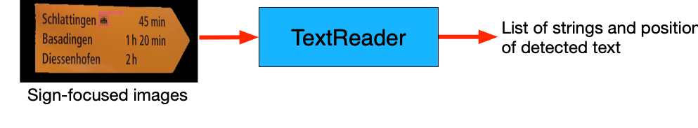
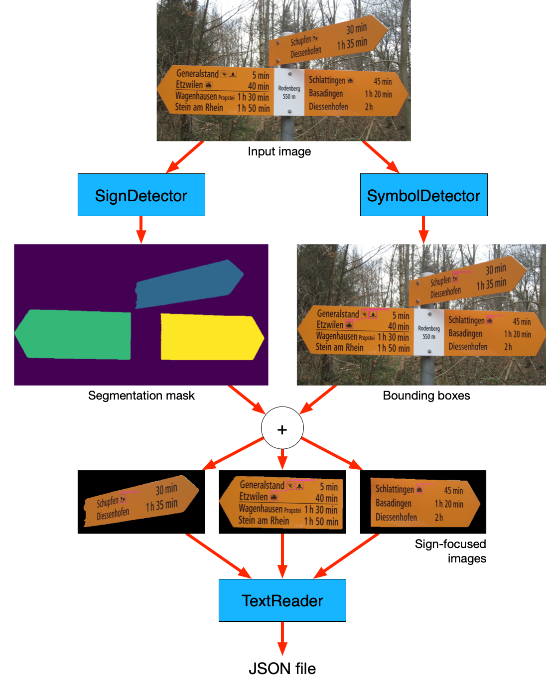

# ImageReader
This class contains the whole image processing pipeline. 
It calls 3 different AI models that can be found in 
`signreader.engine.sign.SignDetector`, 
`signreader.engine.symbol.SymbolDetector`, 
and `signreader.engine.text.TextReader`.

Examples of how to use these classes can be found in `examples/`. 
Please refer to the source code for more details about the inputs and outputs of each class.

# SignDetector

This model achieves instance segmentation using [Cellpose](https://github.com/MouseLand/cellpose).

- **Input**: RGB image (array of size height*width*channels)
- **Output**: Segmentation mask (array of size height*width), each pixel contains an integer, that corresponds to a sign instance label (e.g. '1' for sign 1, '2' for sign 2 etc)

# SymbolDetector

This model achieves bounding box object detection, using [Ultralytics](https://github.com/ultralytics/ultralytics).

- **Input**: RGB image (array of size height*width*channels)
- **Output**: list of boxes. For each box, we have it coordinates, the associated class label (e.g. 'bushof', 'bahnhof' etc), and a confidence score.

# TextReader

This model achieves optical character recognition (OCR), using [Moondream](https://github.com/vikhyat/moondream).
In other words, it allows to transcribe the text in images.

- **Input**: Image (array of size height*width*channels) has to be focused on an individual sign. By multiplying the raw image by a binary instance mask, the resulting image all background (except the considered sign) is blacked out.
- **Output**: list of dict. For each text line, we get the strings of the destination and their corresponding durations, as well as the position of detected text.

# The pipeline

1. `SignDetector` and `SymbolDetector` are applied to the input image.
2. The resulting segmentation masks and bounding boxes are cross-referenced to find out which sign contains which symbol(s).
3. For each detected sign:
   1. Get sign-focused image 
   2. Apply `TextReader` on focused image
   3. Cross-reference detected text and detected symbols to find out which symbol(s) corresponds to which text line
4. Convert the result (list of dict) to JSON file